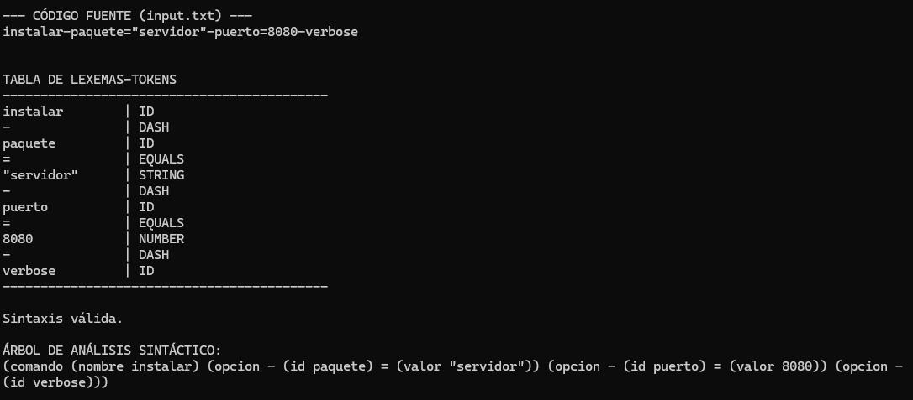
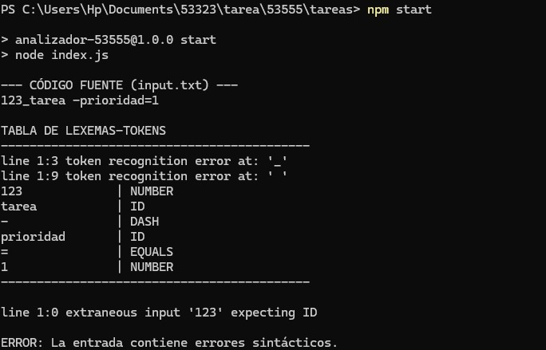
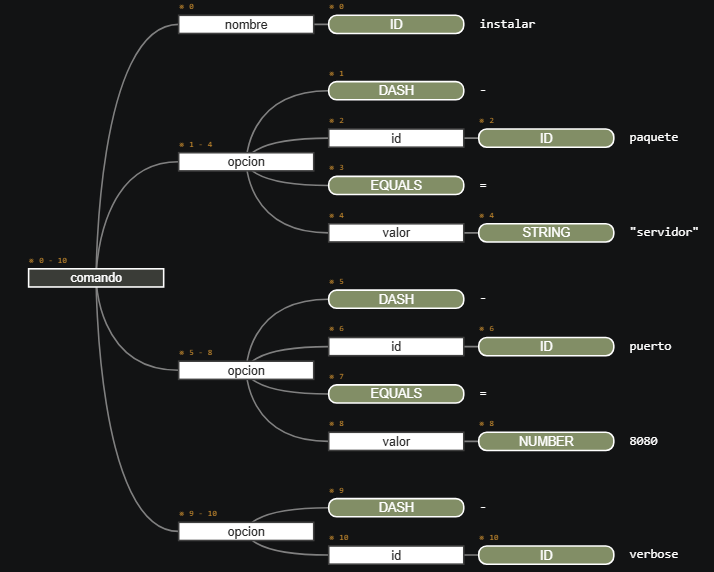

## Instalación

### 1. Clonar
```
git clone https://github.com/federicocent/53323
```

### 2. Ir al la carpeta del proyecto
```
cd 53323
```
### 2. Ejecutar el proyecto
```
npm start
```

## Resultados del análisis

### Salida correcta


### Salida incorrecta


### Árbol de derivación


## Tareas realizadas por el analizador

De acuerdo a la consigna y las pautas de trabajo, el programa realiza lo siguiente:

1. Análisis Léxico y Sintáctico: Valida el código fuente. En caso de error, detalla la línea y la causa del problema.
2. Tabla de Lexemas-Tokens: Genera una visualización en consola con cada lexema reconocido y su respectivo token.
3. Árbol de Análisis Sintáctico: Construye y muestra la estructura jerárquica del código en formato de texto (Parse Tree).
4. Interpretación: Traduce y ejecuta la semántica utilizando un patrón Visitor.

